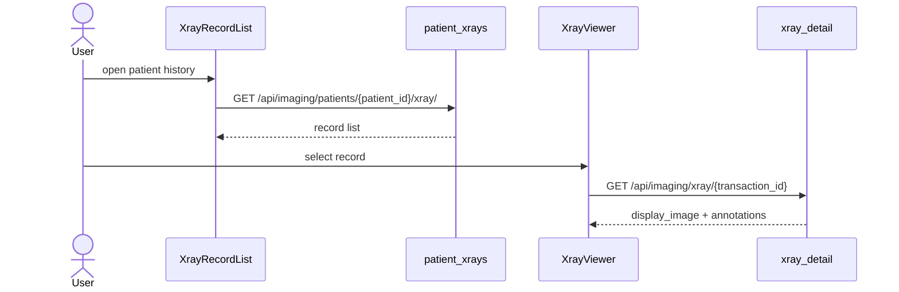

```mermaid
sequenceDiagram
    actor User
    participant List as XrayRecordList
    participant API as patient_xrays
    participant View as XrayViewer
    participant Detail as xray_detail

    User->>List: open patient history
    List->>API: GET /api/imaging/patients/{patient_id}/xray/
    API-->>List: record list
    User->>View: select record
    View->>Detail: GET /api/imaging/xray/{transaction_id}
    Detail-->>View: display_image + annotations
```
