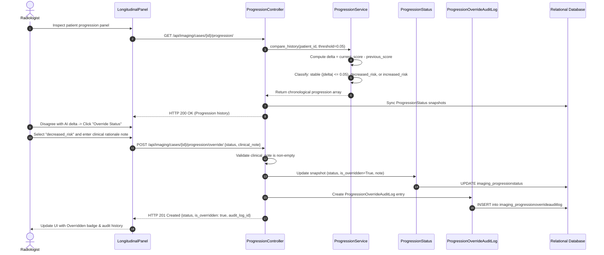

```mermaid
sequenceDiagram
    autonumber
    actor Rad as Radiologist
    participant UI as LongitudinalPanel
    participant Controller as ProgressionController
    participant Service as ProgressionService
    participant ModelStat as ProgressionStatus
    participant ModelAudit as ProgressionOverrideAuditLog
    participant DB as Relational Database

    Rad->>UI: Inspect patient progression panel
    UI->>Controller: GET /api/imaging/cases/{id}/progression/
    Controller->>Service: compare_history(patient_id, threshold=0.05)
    Service->>Service: Compute delta = current_score - previous_score
    Service->>Service: Classify: stable (|delta| <= 0.05), decreased_risk, or increased_risk
    Service-->>Controller: Return chronological progression array
    Controller->>DB: Sync ProgressionStatus snapshots
    Controller-->>UI: HTTP 200 OK (Progression history)

    Rad->>UI: Disagree with AI delta -> Click "Override Status"
    Rad->>UI: Select "decreased_risk" and enter clinical rationale note
    UI->>Controller: POST /api/imaging/cases/{id}/progression/override/ {status, clinical_note}
    Controller->>Controller: Validate clinical_note is non-empty
    Controller->>ModelStat: Update snapshot (status, is_overridden=True, note)
    ModelStat->>DB: UPDATE imaging_progressionstatus
    Controller->>ModelAudit: Create ProgressionOverrideAuditLog entry
    ModelAudit->>DB: INSERT into imaging_progressionoverrideauditlog
    Controller-->>UI: HTTP 201 Created {status, is_overridden: true, audit_log_id}
    UI-->>Rad: Update UI with Overridden badge & audit history
```
