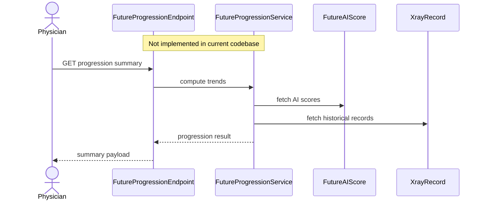

```mermaid
sequenceDiagram
    actor Physician
    participant Endpoint as FutureProgressionEndpoint
    participant Service as FutureProgressionService
    participant Score as FutureAIScore
    participant Rec as XrayRecord

    Note over Endpoint,Service: Not implemented in current codebase
    Physician->>Endpoint: GET progression summary
    Endpoint->>Service: compute trends
    Service->>Score: fetch AI scores
    Service->>Rec: fetch historical records
    Service-->>Endpoint: progression result
    Endpoint-->>Physician: summary payload
```
