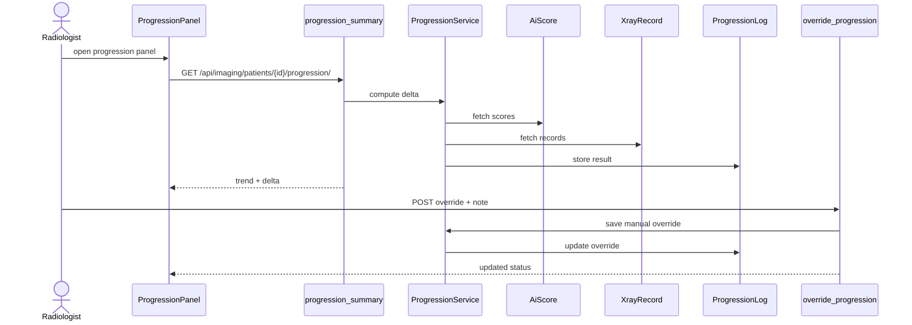

```mermaid
sequenceDiagram
    actor Radiologist
    participant UI as ProgressionPanel
    participant API as progression_summary
    participant Service as ProgressionService
    participant Score as AiScore
    participant Rec as XrayRecord
    participant Log as ProgressionLog
    participant Override as override_progression

    Radiologist->>UI: open progression panel
    UI->>API: GET /api/imaging/patients/{id}/progression/
    API->>Service: compute delta
    Service->>Score: fetch scores
    Service->>Rec: fetch records
    Service->>Log: store result
    API-->>UI: trend + delta

    Radiologist->>Override: POST override + note
    Override->>Service: save manual override
    Service->>Log: update override
    Override-->>UI: updated status
```
