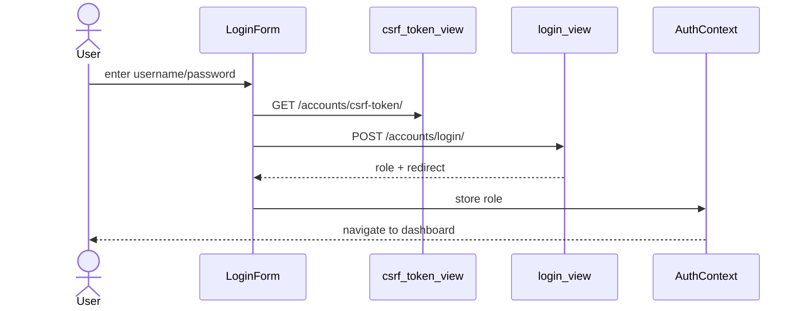

```mermaid
sequenceDiagram
    actor User
    participant Form as LoginForm
    participant CSRF as csrf_token_view
    participant Auth as login_view
    participant Ctx as AuthContext

    User->>Form: enter username/password
    Form->>CSRF: GET /accounts/csrf-token/
    Form->>Auth: POST /accounts/login/
    Auth-->>Form: role + redirect
    Form->>Ctx: store role
    Ctx-->>User: navigate to dashboard
```
