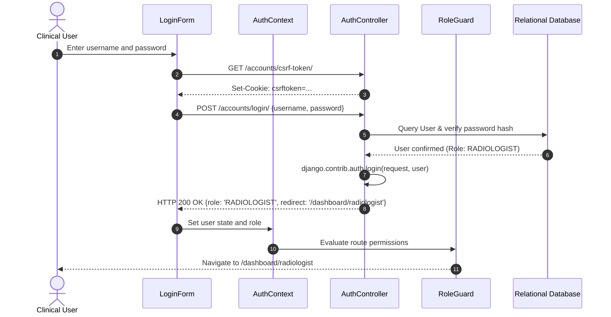

```mermaid
sequenceDiagram
    autonumber
    actor User as Clinical User
    participant Form as LoginForm
    participant Ctx as AuthContext
    participant AuthAPI as AuthController
    participant Guard as RoleGuard
    participant DB as Relational Database

    User->>Form: Enter username and password
    Form->>AuthAPI: GET /accounts/csrf-token/
    AuthAPI-->>Form: Set-Cookie: csrftoken=...
    Form->>AuthAPI: POST /accounts/login/ {username, password}
    AuthAPI->>DB: Query User & verify password hash
    DB-->>AuthAPI: User confirmed (Role: RADIOLOGIST)
    AuthAPI->>AuthAPI: django.contrib.auth.login(request, user)
    AuthAPI-->>Form: HTTP 200 OK {role: 'RADIOLOGIST', redirect: '/dashboard/radiologist'}
    Form->>Ctx: Set user state and role
    Ctx->>Guard: Evaluate route permissions
    Guard-->>User: Navigate to /dashboard/radiologist
```
