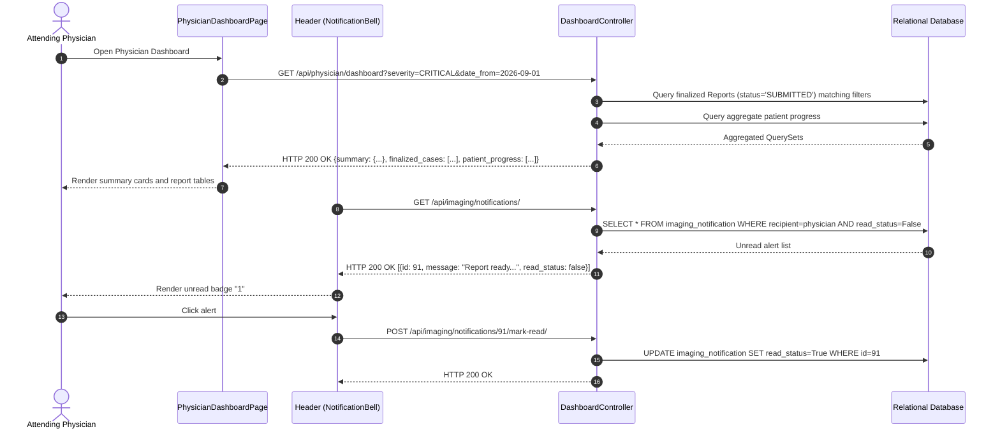

```mermaid
sequenceDiagram
    autonumber
    actor Phys as Attending Physician
    participant Page as PhysicianDashboardPage
    participant Header as Header (NotificationBell)
    participant View as DashboardController
    participant DB as Relational Database

    Phys->>Page: Open Physician Dashboard
    Page->>View: GET /api/physician/dashboard?severity=CRITICAL&date_from=2026-09-01
    View->>DB: Query finalized Reports (status='SUBMITTED') matching filters
    View->>DB: Query aggregate patient progress
    DB-->>View: Aggregated QuerySets
    View-->>Page: HTTP 200 OK {summary: {...}, finalized_cases: [...], patient_progress: [...]}
    Page-->>Phys: Render summary cards and report tables

    Header->>View: GET /api/imaging/notifications/
    View->>DB: SELECT * FROM imaging_notification WHERE recipient=physician AND read_status=False
    DB-->>View: Unread alert list
    View-->>Header: HTTP 200 OK [{id: 91, message: "Report ready...", read_status: false}]
    Header-->>Phys: Render unread badge "1"
    Phys->>Header: Click alert #91 -> POST /api/imaging/notifications/91/mark-read/
    Header->>View: POST /api/imaging/notifications/91/mark-read/
    View->>DB: UPDATE imaging_notification SET read_status=True WHERE id=91
    View-->>Header: HTTP 200 OK
```
