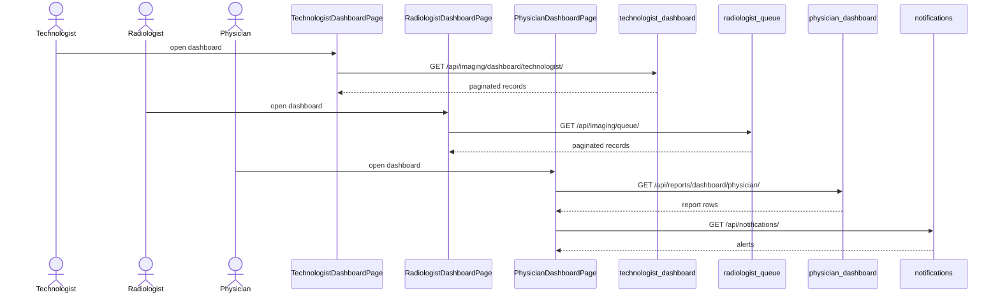

```mermaid
sequenceDiagram
    actor Technologist
    actor Radiologist
    actor Physician
    participant TechPage as TechnologistDashboardPage
    participant RadPage as RadiologistDashboardPage
    participant PhysPage as PhysicianDashboardPage
    participant TechAPI as technologist_dashboard
    participant RadAPI as radiologist_queue
    participant PhysAPI as physician_dashboard
    participant NotifyAPI as notifications

    Technologist->>TechPage: open dashboard
    TechPage->>TechAPI: GET /api/imaging/dashboard/technologist/
    TechAPI-->>TechPage: paginated records

    Radiologist->>RadPage: open dashboard
    RadPage->>RadAPI: GET /api/imaging/queue/
    RadAPI-->>RadPage: paginated records

    Physician->>PhysPage: open dashboard
    PhysPage->>PhysAPI: GET /api/reports/dashboard/physician/
    PhysAPI-->>PhysPage: report rows
    PhysPage->>NotifyAPI: GET /api/notifications/
    NotifyAPI-->>PhysPage: alerts
```
