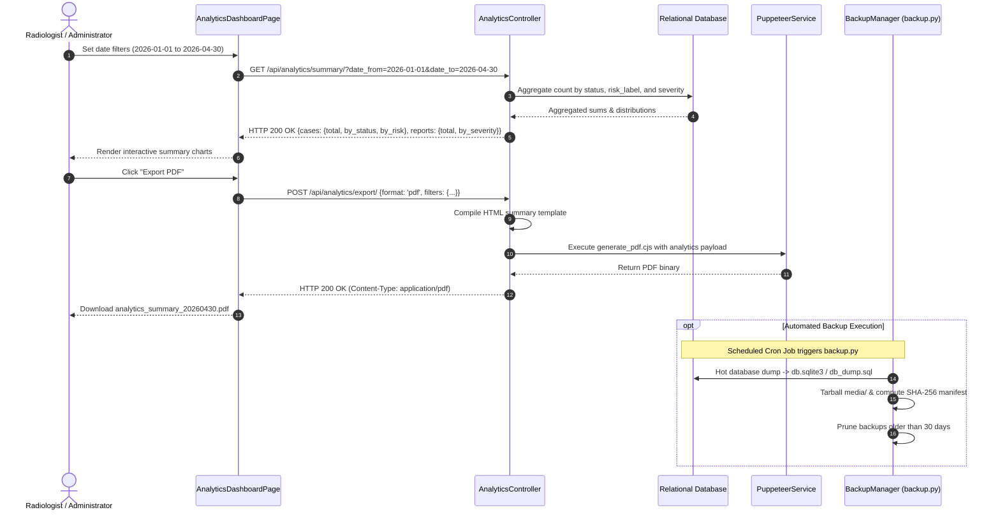

```mermaid
sequenceDiagram
    autonumber
    actor Admin as Radiologist / Administrator
    participant Page as AnalyticsDashboardPage
    participant View as AnalyticsController
    participant DB as Relational Database
    participant Node as PuppeteerService
    participant Backup as BackupManager (backup.py)

    Admin->>Page: Set date filters (2026-01-01 to 2026-04-30)
    Page->>View: GET /api/analytics/summary/?date_from=2026-01-01&date_to=2026-04-30
    View->>DB: Aggregate count by status, risk_label, and severity
    DB-->>View: Aggregated sums & distributions
    View-->>Page: HTTP 200 OK {cases: {total, by_status, by_risk}, reports: {total, by_severity}}
    Page-->>Admin: Render interactive summary charts

    Admin->>Page: Click "Export PDF"
    Page->>View: POST /api/analytics/export/ {format: 'pdf', filters: {...}}
    View->>View: Compile HTML summary template
    View->>Node: Execute generate_pdf.cjs with analytics payload
    Node-->>View: Return PDF binary
    View-->>Page: HTTP 200 OK (Content-Type: application/pdf)
    Page-->>Admin: Download analytics_summary_20260430.pdf

    opt Automated Backup Execution
        Note over Backup, DB: Scheduled Cron Job triggers backup.py
        Backup->>DB: Hot database dump -> db.sqlite3 / db_dump.sql
        Backup->>Backup: Tarball media/ & compute SHA-256 manifest
        Backup->>Backup: Prune backups older than 30 days
    end
```
