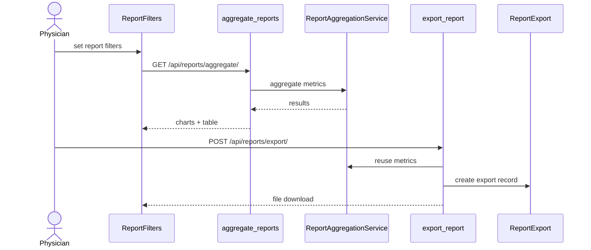

```mermaid
sequenceDiagram
    actor Physician
    participant UI as ReportFilters
    participant API as aggregate_reports
    participant Agg as ReportAggregationService
    participant Export as export_report
    participant PDF as ReportExport

    Physician->>UI: set report filters
    UI->>API: GET /api/reports/aggregate/
    API->>Agg: aggregate metrics
    Agg-->>API: results
    API-->>UI: charts + table

    Physician->>Export: POST /api/reports/export/
    Export->>Agg: reuse metrics
    Export->>PDF: create export record
    Export-->>UI: file download
```
