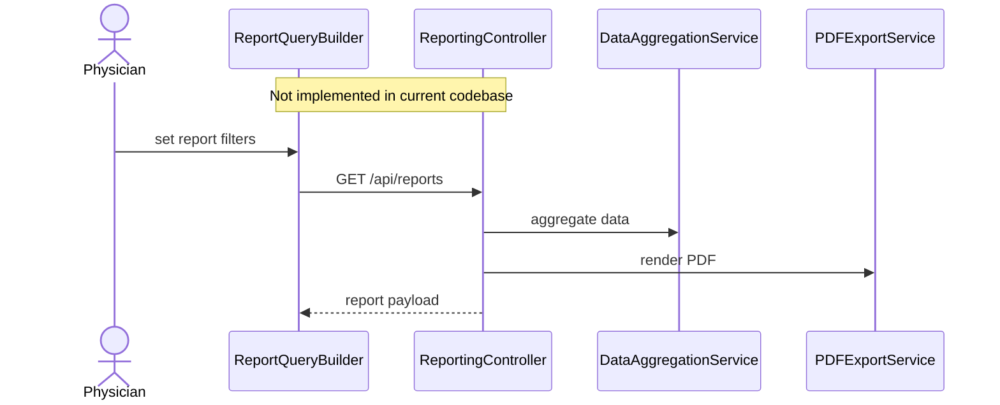

```mermaid
sequenceDiagram
    actor Physician
    participant UI as ReportQueryBuilder
    participant API as ReportingController
    participant Agg as DataAggregationService
    participant PDF as PDFExportService

    Note over UI,API: Not implemented in current codebase
    Physician->>UI: set report filters
    UI->>API: GET /api/reports
    API->>Agg: aggregate data
    API->>PDF: render PDF
    API-->>UI: report payload
```
